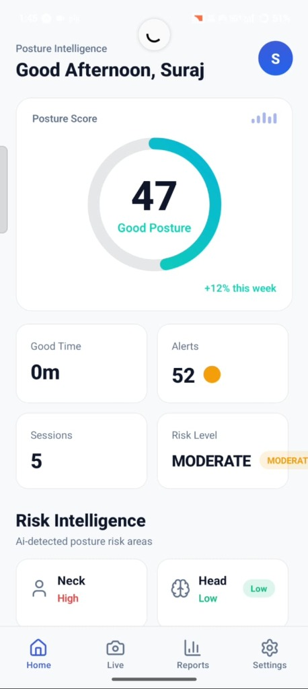
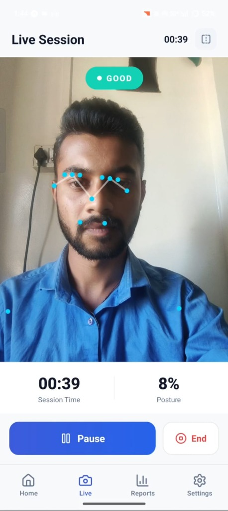
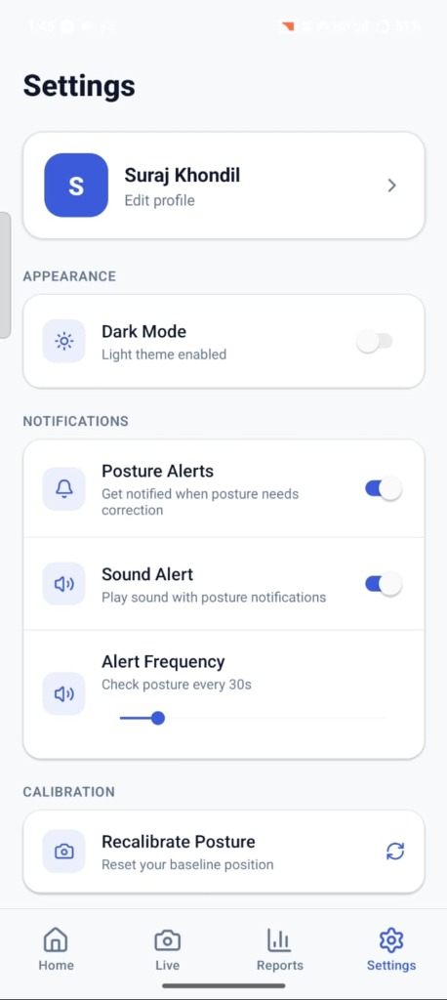
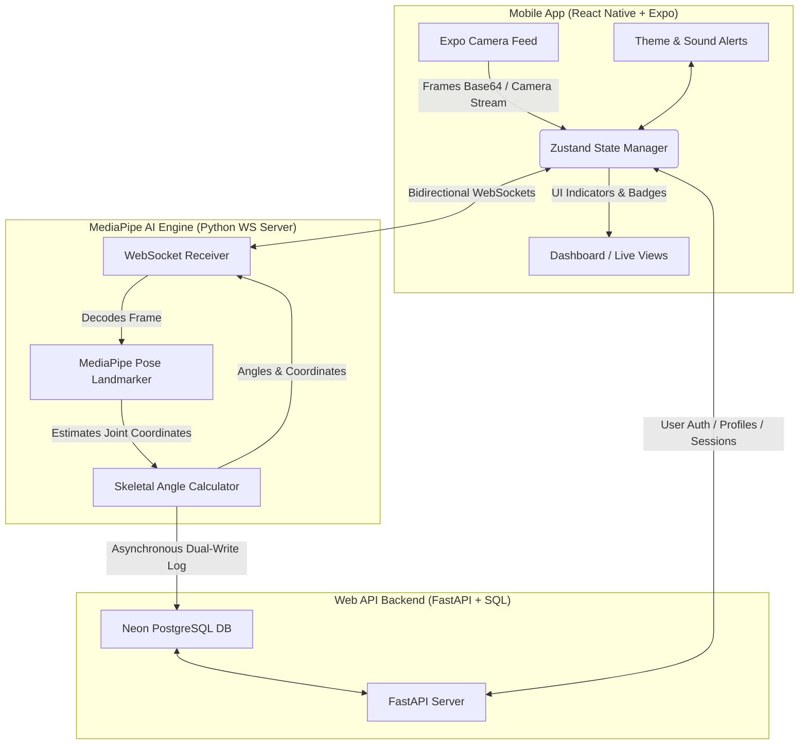

# Posture Coach 🧍‍♂️🔋

> **AI-Powered Real-Time Posture Tracking & Pain Risk Assessment Ecosystem**

---

[](https://reactnative.dev/)
[](https://expo.dev/)
[](https://google.github.io/mediapipe/)
[](https://fastapi.tiangolo.com/)
[](https://neon.tech/)
[](https://www.python.org/)
[](https://www.typescriptlang.org/)
[](https://opensource.org/licenses/MIT)

**Posture Coach** is an advanced, multi-service ergonomic assistant designed to prevent spinal strain and repetitive stress injuries. By utilizing computer vision (MediaPipe) on camera feeds, the platform detects body landmarks, computes skeletal joint angles (such as neck inclination and slouching index), logs session stats to a centralized database (Neon PostgreSQL), and conducts real-time pain risk analysis with smart notifications.

---

## 📸 App Screenshots

| 📱 Home Dashboard | 📹 Live Session | ⚙️ Settings |
| :---: | :---: | :---: |
|  |  |  |
| **Real-time posture score, sessions count, risk level, and neck/head stress indicators.** | **Live camera feed with overlayed skeleton landmarks and posture correction status.** | **Dark mode, sound & local push alert controls, and baseline calibration.** |

---

## 🎯 Key Features

- 📹 **Real-Time Pose Landmark Tracking**: Utilizes Google MediaPipe Pose Landmarker to stream upper-body coordinate metrics over WebSockets.
- 📐 **Skeletal Angle Calculations**: Computes neck lean, shoulder alignment, and slouching indices continuously.
- 📱 **Cross-Platform Expo Client**: Feature-rich React Native client with local storage (AsyncStorage), state management (Zustand), and camera/audio alerts.
- 🗄️ **Dual-Write PostgreSQL Syncing**: Synchronizes real-time metrics into a local database and a shared Neon cloud PostgreSQL repository asynchronously.
- 🔔 **Intelligent Alert System**: Prompts the user with customizable local device notifications and audio sound cues when bad posture is sustained.
- 🧠 **Risk Intelligence Reports**: Translates key joint metrics into actionable neck/head stress levels (Low, Moderate, High) with recommendations.

---

## 🏗️ System Architecture



---

## 📁 Repository Structure

```markdown
├── react-native-app/            # Main React Native (Expo) mobile client application
│   ├── src/                     # Core React Native views, painters, models, state
│   └── package.json             # NPM dependencies & Expo setup
├── python_backend/              # MediaPipe Pose websocket server and database logger
│   ├── pose_server.py           # Local WebSocket server receiving frames and streaming coordinates
│   ├── database.py              # PostgreSQL database insertion and dual-write scripts
│   └── requirements.txt         # Python libraries (mediapipe, websockets, sqlalchemy)
├── posture-coach-team-copy/     # Collaborative project copies (Shared backend/frontend)
│   ├── backend/                 # Central FastAPI Web API server for auth, profiles, and sessions
│   └── frontend/                # Combined Expo React Native frontend
├── docs/images/                 # Repository documentation screenshots
└── temp_pose_engine/            # [Legacy] Archived Flutter desktop application implementation
```

---

## 🚀 Getting Started

The repository offers two execution configurations:
1. **Pose Engine App** (Stand-alone React Native app + Python MediaPipe server)
2. **Posture Coach Platform** (Multi-team collaborative app + Python MediaPipe server + FastAPI backend)

### Configuration A: Pose Engine App (Stand-alone)
This setup runs the main `react-native-app` which interfaces directly with the Python MediaPipe WebSocket server.

1. **One-Time Setup**:
   Double-click the `setup_rn.bat` script in the root directory. This will automatically install python dependencies and configure NPM packages inside `react-native-app`.
2. **Run the Application**:
   Double-click `run_rn.bat`. It will launch the WebSocket pose detection server and spin up the Expo development environment. Scan the QR code using the **Expo Go** app on your phone.

---

### Configuration B: Posture Coach Platform (Integrated)
This setup runs the team collaborative project containing user authentication, calibration screens, and pain-risk analytical dashboards.

1. **One-Time Setup**:
   Navigate to backend and frontend folders to configure libraries:
   ```bash
   # Backend Setup
   cd posture-coach-team-copy/backend
   python -m venv venv
   source venv/Scripts/activate # Windows: .\venv\Scripts\activate
   pip install -r requirements.txt

   # Frontend Setup
   cd ../frontend
   npm install
   ```
2. **Run All Servers**:
   Double-click the `start.bat` script in the root (or run `python start.py`). This launches:
   - MediaPipe WebSocket Server (Port `8765`)
   - FastAPI PostgreSQL Web Server (Port `8000`)
   - Expo Mobile Frontend (interactive terminal for QR scanning)

---

## 💾 Database Schema (`raw_angles`)

The database logs coordinates of every calibration scan and active monitoring session.

| Column Name | Data Type | Description |
| :--- | :--- | :--- |
| `id` | `Integer (PK)` | Auto-incrementing identifier |
| `session_id` | `Integer (Index)` | Unique reference key to active user session |
| `frame_id` | `BigInteger` | Tracked frame index |
| `camera_angle` | `String(10)` | Camera perspective direction (`FRONT` or `SIDE`) |
| `angle_data` | `JSON` | Computed joint degrees (e.g. neck lean, slouch index) |
| `confidence_data`| `JSON` | Landmark detection probability ratings |
| `is_calibrated` | `Boolean` | Denotes if baseline configuration has been applied |
| `timestamp_iso` | `String(50)` | Date and time in ISO format |
| `timestamp_ms` | `Float` | Epoch timestamp millisecond record |

---

## 📝 License

Distributed under the MIT License. See [LICENSE](LICENSE) for more information.
